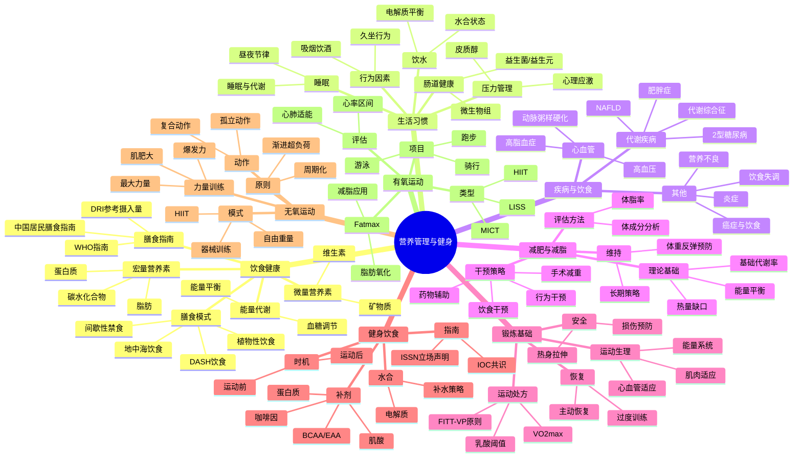

# 营养管理与健身 - 整体知识拓扑图

```mermaid
mindmap
  root((营养管理与健身))
    饮食健康
      宏量营养素
        蛋白质
        碳水化合物
        脂肪
      微量营养素
        维生素
        矿物质
      能量代谢
        能量平衡
        血糖调节
      膳食模式
        地中海饮食
        DASH饮食
        间歇性禁食
        植物性饮食
      膳食指南
        WHO指南
        中国居民膳食指南
        DRI参考摄入量
    生活习惯
      睡眠
        睡眠与代谢
        昼夜节律
      压力管理
        皮质醇
        心理应激
      行为因素
        久坐行为
        吸烟饮酒
      饮水
        水合状态
        电解质平衡
      肠道健康
        微生物组
        益生菌/益生元
    疾病与饮食
      代谢疾病
        肥胖症
        2型糖尿病
        代谢综合征
        NAFLD
      心血管
        高血压
        高脂血症
        动脉粥样硬化
      其他
        癌症与饮食
        饮食失调
        营养不良
        炎症
    减肥与减脂
      理论基础
        能量平衡
        热量缺口
        基础代谢率
      评估方法
        体脂率
        体成分分析
      干预策略
        饮食干预
        行为干预
        药物辅助
        手术减重
      维持
        体重反弹预防
        长期策略
    锻炼基础
      运动生理
        能量系统
        心血管适应
        肌肉适应
      运动处方
        FITT-VP原则
        VO2max
        乳酸阈值
      恢复
        主动恢复
        过度训练
      安全
        热身拉伸
        损伤预防
    健身饮食
      补剂
        蛋白质
        肌酸
        BCAA/EAA
        咖啡因
      时机
        运动前
        运动后
      水合
        电解质
        补水策略
      指南
        ISSN立场声明
        IOC共识
    无氧运动
      力量训练
        最大力量
        肌肥大
        爆发力
      原则
        渐进超负荷
        周期化
      动作
        复合动作
        孤立动作
      模式
        HIIT
        自由重量
        器械训练
    有氧运动
      类型
        MICT
        LISS
        HIIT
      评估
        心肺适能
        心率区间
      Fatmax
        脂肪氧化
        减脂应用
      项目
        跑步
        游泳
        骑行
```

---

> 此拓扑图随知识库内容更新而更新
> 每个模块另有独立详细拓扑图
