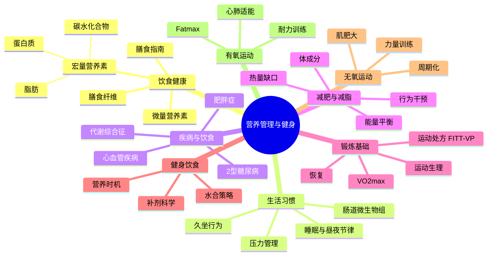

# 知识拓扑图

```mermaid
mindmap
  root((营养管理与健身))
    饮食健康
      宏量营养素
        蛋白质
        碳水化合物
        脂肪
      微量营养素
      膳食纤维
      膳食指南
    生活习惯
      睡眠与昼夜节律
      压力管理
      久坐行为
      肠道微生物组
    疾病与饮食
      肥胖症
      2型糖尿病
      心血管疾病
      代谢综合征
    减肥与减脂
      能量平衡
      热量缺口
      体成分
      行为干预
    锻炼基础
      运动生理
      运动处方 FITT-VP
      VO2max
      恢复
    健身饮食
      补剂科学
      营养时机
      水合策略
    无氧运动
      力量训练
      肌肥大
      周期化
    有氧运动
      心肺适能
      Fatmax
      耐力训练
```

> 每个模块另有独立详细拓扑图，见 `_topology/` 目录
